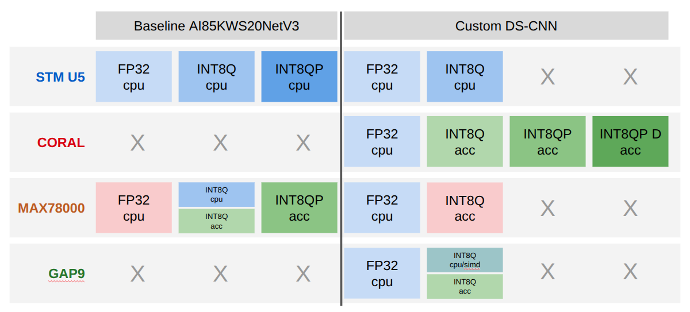

# ML on MCU Keyword Spotting

<p align="center">
  
</p>

This repository contains the embedded keyword-spotting work for two model families: `ai85kws20netv3_model` and `cnn-trad-fpool3_model`. Each model folder contains its platform ports, model artifacts, measurement helpers, and result exports. Power traces and peak analyses are kept separately in `Experiments`.

The goal was not just to run one model once, but to compare deployment paths across MCUs/accelerators: floating-point vs. int8, unpruned vs. pruned variants, CPU inference vs. hardware acceleration, and latency/memory/energy tradeoffs.

## Overview

<p align="center">
  
</p>

The overview image summarizes the experiment matrix: model families are columns, target platforms are rows, and each box is one deployment mode. Blue boxes are CPU deployments, green boxes are accelerator-backed deployments, and red boxes mark variants that were evaluated but are not practically deployable or not useful as final embedded targets. `FP32`, `INT8Q`, `INT8QP`, and `INT8QP D` denote floating point, quantized, quantized+pruned, and quantized+pruned+distilled variants. `X` marks combinations that were not implemented or not meaningful.

## Project Scope

`ai85kws20netv3_model` contains the AI85KWS20NetV3 model artifacts, platform firmware projects, test vectors, measurement scripts, and processed result exports.

`cnn-trad-fpool3_model` contains the DS-CNN model artifacts, training scripts, platform firmware projects, testbench outputs, and processed result exports.

`Experiments` contains the raw power-measurement archive, including PPK2 traces, peak windows, and power-analysis reports.

## Repository Layout

```text
MLonMCU_Project/
+-- ai85kws20netv3_model/
|   +-- models/                  # ONNX/checkpoint/model artifacts
|   +-- platforms/
|   |   +-- max78000/             # MAX78000 firmware, demos, measurement tools
|   |   +-- stm32u5/              # STM32U5 CubeAI projects and measurement tools
|   +-- results/                  # processed plots/tables for AI85KWS20NetV3
|   +-- test_vectors/
+-- cnn-trad-fpool3_model/
|   +-- models/                  # DS-CNN model artifacts
|   +-- platforms/
|   |   +-- coral/                # Coral Micro / Edge TPU apps
|   |   +-- gap9/                 # GAP9 deployments and profiling
|   |   +-- max78000/             # MAX78000 DS-CNN ports
|   |   +-- stm32u5/              # STM32U5 DS-CNN CubeAI projects
|   +-- results/                  # DS-CNN testbench summaries and ledger
|   +-- training/                 # Keras training, pruning, distillation scripts
+-- Experiments/
|   +-- PWR Consumption/          # raw PPK2 CSVs, peak analyses, power reports
+-- presentation/                 # presentation slides and figures
+-- Papers/
```

## Results

The following tables summarize the final benchmark numbers for the evaluated deployments. They combine model accuracy, on-device accuracy, latency, memory footprint, and measured energy per inference so the different platforms and optimization paths can be compared directly.

Interpretation notes:

- Lower latency, memory, and energy are better.
- Higher model accuracy and MCU accuracy are better.
- Flash/SRAM columns are platform-specific approximations of deployment footprint; for Coral, the flash value is the baked model size and SRAM refers to the Edge TPU cache or SDRAM note shown in the table.
- `N` is the number of evaluated clips or measured inference windows, depending on the experiment path.

### DS-CNN (`cnn-trad-fpool3`)

| Timestamp | Board | Config | Model | N | Model accuracy % | MCU accuracy % | Lat avg (ms) | Lat p95 (ms) | Flash/.text / L2 (KiB) | SRAM / L1 scratch (KiB) | Energy/Inference (uJ) | Run |
|---|---|---|---|---|---|---|---|---|---|---|---|---|
| 2026-06-10 17:45 | max | int8-accel | v1 | 144 | 92.0 | 67.36 | 0.162 | 0.162 | 139.5 | 38.0 | 23.62 | cnn-trad-fpool3_model/results/results/max_v1 |
| 2026-06-10 17:30 | max | fp32-cpu | v0 | 144 | 92.4 | 93.75 | 1988.121 | 1988.147 | 208.8 | 99.7 | 97246.96 | cnn-trad-fpool3_model/results/results/max_v0 |
| 2026-06-10 18:45 | u5 | int8-cpu | v1 | 144 | 92.0 | 91.67 | 64.091 | 64.096 | 150.5 | 82.8 | 13466.62 | cnn-trad-fpool3_model/results/results/u5_v1 |
| 2026-06-10 18:57 | u5 | fp32-cpu | v0 | 144 | 92.4 | 93.75 | 224.542 | 224.543 | 220.8 | 125.8 | 18905.89 | cnn-trad-fpool3_model/results/results/u5_v0 |
| 2026-06-10 20:21 | coral | int8-accel | v1 | 144 | 92.0 | 91.67 | 2.346 | 2.372 | 144.6 | 62.0 | 1932.03 | cnn-trad-fpool3_model/results/results/coral_v1 |
| 2026-06-10 20:25 | coral | fp32-cpu | v0 | 144 | 92.4 | 90.97 | 417.012 | 417.240 | 144.5 | 65.4 (SDRAM) | 316970.53 | cnn-trad-fpool3_model/results/results/coral_v0 |
| 2026-06-11 17:59 | coral | int8-prune | v21 | 144 | 89.7 | 88.89 | 1.961 | 1.991 | 120.6 | 46.5 | 1603.45 | cnn-trad-fpool3_model/results/results/coral_v21 |
| 2026-06-11 18:03 | coral | int8-prune | v22 | 144 | 76.7 | 72.22 | 2.295 | 2.330 | 108.6 | 39.0 | 1795.69 | cnn-trad-fpool3_model/results/results/coral_v22 |
| 2026-06-11 18:05 | coral | int8-prune | v23 | 144 | 65.1 | 62.50 | 1.911 | 1.957 | 92.6 | 30.5 | 1535.30 | cnn-trad-fpool3_model/results/results/coral_v23 |
| 2026-06-11 18:09 | coral | int8-prune-distill | v31 | 144 | 90.8 | 90.28 | 1.958 | 1.987 | 120.6 | 46.5 | 1610.40 | cnn-trad-fpool3_model/results/results/coral_v31 |
| 2026-06-11 18:12 | coral | int8-prune-distill | v32 | 144 | 76.5 | 77.78 | 1.911 | 1.953 | 92.6 | 30.5 | 1584.47 | cnn-trad-fpool3_model/results/results/coral_v32 |
| 2026-06-10 17:09 | gap9 | fp32-cluster | v0 | 144 | 92.4 | 91.62 | 116.806 | 116.868 | 46.48 | 134.08 | 3893.85 | cnn-trad-fpool3_model/results/results/gap9_v0 |
| 2026-06-09 14:45 | gap9 | int8-cluster | v1 | 144 | 92.0 | 91.45 | 17.153 | 17.165 | 46.69 | 32.86 | 480.11 | cnn-trad-fpool3_model/results/results/gap9_v1 |
| 2026-06-09 17:28 | gap9 | int8-ne16 | v2 | 144 | 92.0 | 91.23 | 0.786 | 0.786 | 36.38 (L2 total) | 20.02 (L1) | 34.32 | cnn-trad-fpool3_model/results/results/gap9_v2 |

### AI85KWS20NetV3

| Timestamp | Board | Config | Model | N | Model accuracy % | MCU accuracy % | Lat avg (ms) | Lat p95 (ms) | Flash/.text / L2 (KiB) | SRAM / L1 scratch (KiB) | Energy/Inference (uJ) | Run |
|---|---|---|---|---|---|---|---|---|---|---|---|---|
| 2026-06-08 15:16 | max | int8-cpu | v0_0 | 16 | 90.80 | 89.43 | 897.288 | 897.290 | 397.8 | 66.7 | 49541.78 | ai85kws20netv3_model/results/max78000/ai85kws20netv3_model_v0 |
| 2026-05-05 16:48 | max | int8-accel | v0 | 11 | 90.80 | 91.25 | 1.849 | 1.849 | 381.1 | 37.7 | 283.39 | ai85kws20netv3_model/results/max78000/ai85kws20netv3_model_v1 |
| 2026-05-08 22:44 | max | int8-accel-w90 | v1 | 7 | 85.10 | 83.47 | 1.711 | 1.711 | 357.5 | 37.8 | 250.94 | ai85kws20netv3_model/results/max78000/ai85kws20netv3_model_v2 |
| 2026-05-04 19:22 | u5 | fp32-cpu | v0 | 6 | 91.17 | 91.23 | 397.242 | 397.242 | 724.1 | 238.1 | 31394.71 | ai85kws20netv3_model/results/stm32u5/ai85kws20netv3_model_v0 |
| 2026-05-06 18:22 | u5 | int8-cpu | v1 | 3 | 90.80 | 90.01 | 173.839 | 173.839 | 250.1 | 180.8 | 12751.97 | ai85kws20netv3_model/results/stm32u5/ai85kws20netv3_model_v1 |
| 2026-05-10 16:10 | u5 | int8-cpu-w90 | v2 | 13 | 85.10 | 84.27 | 152.922 | 152.922 | 226.7 | 176.8 | 11475.73 | ai85kws20netv3_model/results/stm32u5/ai85kws20netv3_model_v2 |

## Where To Look

- `ai85kws20netv3_model/platforms/` contains the MAX78000 and STM32U5 firmware projects for the AI85KWS20NetV3 experiments.
- `cnn-trad-fpool3_model/platforms/` contains the Coral, GAP9, MAX78000, and STM32U5 DS-CNN deployments.
- `cnn-trad-fpool3_model/results/results/RESULTS_LEDGER.md` is the source ledger for the benchmark tables.
- `Experiments/PWR Consumption/` contains raw power CSVs and peak-analysis outputs.
